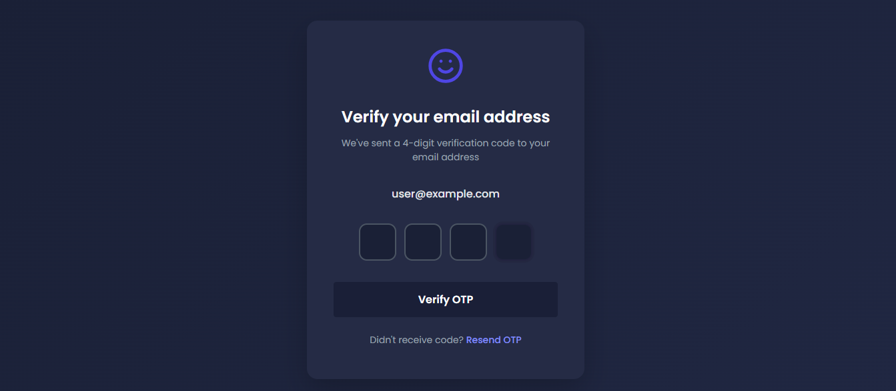
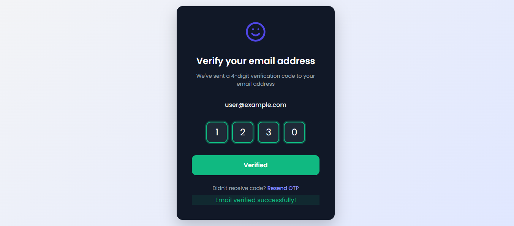
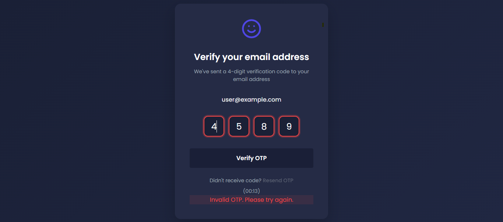

# 🔐 OTP Verification Component - Frontend Project

A sleek and modern OTP (One-Time Password) verification component designed for frontend practice and real-world applications. It validates a 4-digit code with smooth input transitions, animations, and visual feedback.





---

## 📌 Project Details

**Project Name:** OTP Verification Component  
**Level:** Frontend Intermediate  
**Goal:** To create a responsive OTP verification UI with input validation, interactive feedback, and modern design aesthetics.

---

## 🚀 Features

- ✅ **4-digit OTP Input** — One box per digit
- ✅ **Auto-focus & Backspace Navigation**
- ✅ **Success/Error Handling**
- ✅ **Green Border on Correct OTP**
- ✅ **Red Border on Incorrect OTP**
- ✅ **Timer with Resend OTP Option**
- ✅ **Fully Responsive Design**
- ✅ **Dark Theme UI with Modern Gradients**
- ✅ **Animated Transitions & Alerts**

---

## 🎨 Design Overview

| Element              | Value                      |
|----------------------|----------------------------|
| Background           | `#252b45` (dark mode)      |
| Input Box Border     | `#4b5563` (default)        |
| Valid Border Color   | `#10b981` (green)          |
| Invalid Border Color | `#ef4444` (red)            |
| Primary Button       | `#1a1f37` (bluish-purple)  |
| Font Family          | `'Poppins', sans-serif`    |

---

## 🛠 Technologies Used

- **HTML5** — Structure
- **CSS3** — Styling, transitions, animations
- **JavaScript (Vanilla)** — OTP logic, timer, DOM handling
- **Google Fonts** — Poppins
- **Responsive Design** — Media queries

---

## 📁 File Structure

otp-verification/
├── index.html # Main HTML page
├── styles.css # All styling and layout
├── script.js # Functional JS for OTP logic
├── assets/
│ └── preview.png # Screenshot of the design


---

## 📱 Responsive Breakpoints

- **Mobile:** ≤ 480px
- **Tablet:** 481px - 768px
- **Desktop:** ≥ 769px

---

## ✅ How to Use

1. Clone the repository:

   ```bash
   git clone https://github.com/yourusername/otp-verification.git

2. Enter OTP (Default: 1230).

3. Try entering incorrect OTP to see validation styles.

4. Click Resend OTP to reset input and timer.

const correctOTP = '1230';

🙌 Author
Md Farhan Alam
Frontend Developer & UI/UX Designer


